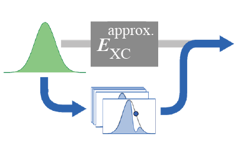

Conditional Probability Density Functional Theory (CP-DFT)
===============================

Overview
------------
CP-DFT is a DFT method that determines the ground-state energy of a system by finding the conditional probability (CP) density from a series of
independent Kohn-Sham (KS) DFT calculations. By directly calculating CP densities, and thus the exchange-correlation (XC) hole, we bypass the need for an approximate XC energy functional.




[This library](https://github.com/pedersor/cond_prob_dft_1d) contains code to reproduce the 1-dimensional (1D) examples
presented in the following work:


Ryan Pederson, Jielun Chen, Steven R. White, and Kieron Burke. 
"Conditional probability density functional theory." 
*Phys. Rev. B **105**, 245138 (2022)* [arXiv:2203.09647](https://arxiv.org/abs/2203.09647)


Installation (Linux)
------------

* First install the [DFT_1D](https://github.com/pedersor/DFT_1d) module and dependencies:
```
$ git clone https://github.com/pedersor/DFT_1d.git
$ cd DFT_1d
$ pip install .
```

* Next, in a different directory, install the conditional probability DFT module 
```
$ git clone https://github.com/pedersor/cond_prob_dft_1d.git
$ cd cond_prob_dft_1d
$ pip install .
```

## Examples
The example figures in the paper can be generated by the following code in `1d_examples/`, e.g., the 1D Be atom figures are obtained by executing
```
$ cd 1d_examples/1d_be_fig/
$ python3 fig.py
``` 
Other examples are generated similarly. The file `exact_pair_density.dat` is obtained from DMRG results using an identical 1D grid as the CP-DFT calculations. 

## Disclaimer
This library is in *alpha*.
